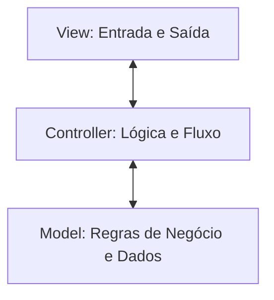

# 👑 GUIA DE DESENVOLVIMENTO: DO CAMARIM À PASSARELA! 💖

Seja muito bem-vinda, **Miss Gay Ribeirão Preto**! 💅✨
*(E lembre-se: o sistema se chama **Sis**Clinicas, porque se fosse **Cis**Clinicas não teria tanto brilho! 🦄)*

Este é o seu guia definitivo para programar no **SisClinicas**. Aqui você vai aprender a preparar o seu ambiente, entender a estrutura do projeto e seguir o passo a passo para construir as funcionalidades que faltam com muito glamour, organização e zero desespero!

---

## 💄 1. PREPARANDO O CAMARIM (Configuração do Ambiente no Windows)

Antes de começar o show, precisamos garantir que as maquiagens e os espelhos estão no lugar. No Windows, siga estes passos no terminal (PowerShell ou Prompt de Comando):

### Passo A: Criar e Ativar o Ambiente Virtual (venv)
O ambiente virtual garante que as ferramentas de formatação do código fiquem isoladas e organizadas.
1. Abra a pasta do projeto no VS Code.
2. Abra o terminal (menu `Terminal` -> `New Terminal`).
3. Digite o seguinte comando para criar o ambiente:
   ```powershell
   python -m venv venv
   ```
4. Para ativar o ambiente no Windows (PowerShell):
   ```powershell
   .\venv\Scripts\Activate.ps1
   ```
   *(Se aparecer um erro de permissão no PowerShell, você pode usar `.\venv\Scripts\activate.bat` no Prompt de Comando normal).*

### Passo B: Instalar as Dependências
Com o ambiente ativado, instale as ferramentas necessárias (como o formatador de código Black):
```powershell
pip install -r requirements.txt
```

### Passo C: Rodando o Sistema (Com Emojis Silenciosos)
Como nosso sistema usa emojis fofos nas telas, o Windows às vezes se confunde com os caracteres. Para rodar sem dar erro de codificação, defina a variável de ambiente para UTF-8 no terminal e execute o sistema:
* No **PowerShell** (Recomendado):
  ```powershell
  $env:PYTHONIOENCODING="utf-8"
  python src/main.py
  ```
* No **Prompt de Comando (CMD)**:
  ```cmd
  set PYTHONIOENCODING=utf-8
  python src/main.py
  ```

---

## 🏛️ 2. A COREOGRAFIA DO CÓDIGO (Arquitetura MVC)

O sistema é dividido em três camadas que conversam entre si como uma equipe de desfile:



* **MODEL (A Diva Real - `src/models/`)**: Onde moram as regras rígidas. Por exemplo, o model `Atendimento` não permite pacientes menores de 18 anos. **Não modifique nenhum arquivo aqui.** Eles já estão prontos e perfeitos!
* **VIEW (O Look - `src/view/`)**: Onde a gente fala com o usuário. Só tem comandos `input()` e `print()`. Ela recolhe as strings que o usuário digita e entrega para o controlador.
* **CONTROLLER (O Coreógrafo - `src/controller/`)**: Pega as strings da View, converte em números ou datas, trata erros e cria/atualiza os objetos do Model.

---

## 🛠️ 3. PASSO A PASSO DAS NOVAS FUNCIONALIDADES

Aqui está a receita de bolo (com exemplos práticos) para você arrasar nas tarefas:

---

### DESFILE 1: Cadastro de Clínicas (O Palco)

Precisamos gerenciar as clínicas onde ocorrem os atendimentos. Você criará a **View** e o **Controller** baseando-se no modelo abaixo:

#### A) Criar a View: `src/view/tela_clinica.py`
Crie este arquivo para lidar com a interação com o usuário:

```python
class TelaClinica:
    def mostrar_opcoes(self):
        print("\n🏥 ---- GERENCIAR CLÍNICAS ---- 🏥")
        print("1 - Incluir Nova Clínica")
        print("2 - Listar Clínicas")
        print("0 - Voltar")
        # TODO: Implemente a leitura e retorno da opção digitada.
        # Dica: use try/except ValueError para tratar se digitarem letras!
        pass

    def pega_dados_clinica(self):
        # TODO: Leia o ID, Nome, Localização e Descrição do teclado usando input()
        # Valide se nenhum campo veio vazio e retorne um dicionário com os dados
        pass

    def mostra_mensagem(self, mensagem):
        # TODO: Exiba a mensagem no terminal
        pass

    def listar_clinicas(self, clinicas):
        # TODO: Percorra a coleção de clínicas e mostre-as formatadas na tela
        pass
```

#### B) Criar o Controller: `src/controller/controlador_clinica.py`
Crie este arquivo para fazer as validações e armazenar as clínicas:

```python
from view.tela_clinica import TelaClinica
from models.clinica import Clinica

class ControladorClinica:
    def __init__(self, controlador_sistema):
        self.__clinicas = {}
        self.__controlador_sistema = controlador_sistema
        self.__tela = TelaClinica()

    def buscar_clinica(self, id_clinica: int):
        # TODO: Busque e retorne o objeto clínica do dicionário self.__clinicas pelo ID
        pass

    def incluir_clinica(self):
        # TODO: Pegue os dados da tela, converta o ID para int, verifique se já existe
        # e instancie o model Clinica salvando em self.__clinicas.
        # Dica: trate ValueError e InvalidOperation ao converter os tipos!
        pass

    def listar_clinicas(self):
        # TODO: Chame o método da view passando a lista de clínicas cadastradas
        pass

    def retorna_tela(self):
        self.__controlador_sistema.abre_tela()

    def abre_tela(self):
        # TODO: Implemente o menu de controle associando cada opção ao seu método
        pass
```

#### C) Registrar o Controlador no Sistema (`src/controller/controlador_sistema.py`)
1. Importe o controlador no topo do arquivo:
   ```python
   from controller.controlador_clinica import ControladorClinica
   ```
2. Instancie no `__init__`:
   ```python
   self.__controlador_clinica = ControladorClinica(self)
   ```
3. Crie a propriedade de acesso para que outros controladores usem:
   ```python
   @property
   def controlador_clinica(self) -> ControladorClinica:
       return self.__controlador_clinica
   ```
4. Associe o submenu correspondente no menu principal!

---

### DESFILE 2: Cadastro de Tipos de Atendimento

Siga exatamente a mesma fórmula do cadastro de clínicas, mas usando a entidade `TipoAtendimento` (presente em `src/models/tipo_atendimento.py`). 
* Atributos: `id`, `nome`, `codigo`.
* Crie `tela_tipo_atendimento.py` e `controlador_tipo_atendimento.py`.
* Integre no `ControladorSistema`.
* **Substituição Importante:** No arquivo [controlador_atendimento.py](file:///c:/Users/ramos/Documents/repositories/ine5605-gerenciador-clinicas/src/controller/controlador_atendimento.py), localize onde criamos o tipo de atendimento temporário (comentário `TODO` na linha 64) e substitua a busca estática pela busca no seu novo controlador:
  ```python
  tipo_atendimento = self.__controlador_sistema.controlador_tipo_atendimento.buscar_tipo_atendimento(int(dados_atendimento["tipo_atendimento"]))
  ```

---

### DESFILE 3: Registro de Pagamentos (O Fechamento do Caixa)

Você deve permitir registrar o pagamento de um atendimento existente. Os pagamentos são instanciados a partir de classes filhas do model `Pagamento` em `src/models/pagamento.py`.

#### Como Instanciar um Pagamento:
No controlador de atendimento, ao criar uma opção "Registrar Pagamento", siga essa lógica:
1. Peça o ID do Atendimento e busque-o.
2. Peça o valor e a data do pagamento.
3. Escolha o Método de Pagamento (Pix, Cartão ou Dinheiro):
   * **Pix**: Precisa instanciar `MetodoPix(chave, tipo_chave)`.
   * **Cartão**: Precisa instanciar `MetodoCartao(numero, bandeira)`.
   * **Dinheiro**: Precisa instanciar `MetodoDinheiro()`.
4. Crie a classe base `Pagamento`:
   ```python
   from models.pagamento import Pagamento
   
   novo_pagamento = Pagamento(
       id_pagamento,
       data_datetime,
       valor_decimal,
       atendimento.paciente,
       atendimento,
       metodo_escolhido
   )
   ```
5. Vincule o pagamento no atendimento:
   ```python
   atendimento.adiciona_pagamento(novo_pagamento)
   ```

---

### DESFILE 4: Relatórios e Estatísticas

No arquivo `src/controller/controlador_relatorio.py`, você deve implementar os métodos que estão comentados ou vazios.

#### 1. Clínicas com mais Atendimentos
```python
def top_clinicas_com_mais_atendimentos(self):
    atendimentos = self.__controlador_sistema.controlador_atendimento.atendimentos
    
    # TODO: Crie um dicionário para contar quantos atendimentos cada clínica tem.
    # Ex: percorra os atendimentos, pegue o nome da clínica e incremente no dicionário.
    
    # TODO: Ordene essas contagens em ordem decrescente (do maior para o menor).
    # Dica: use a função sorted() com key e reverse=True.
    
    # TODO: Mostre o ranking na tela usando o método self.__tela_relatorio.mostra_mensagem.
    pass
```

#### 2. Procedimentos Mais Caros e Mais Baratos
```python
def procedimentos_mais_caros_ou_baratos(self):
    atendimentos = self.__controlador_sistema.controlador_atendimento.atendimentos
    top_n = self.__tela_relatorio.solicita_top_n()
    ordem = self.__tela_relatorio.solicita_ordem() # 1 para mais caros, 2 para mais baratos
    
    # TODO: Colete todos os procedimentos vinculados a todos os atendimentos cadastrados.
    
    # TODO: Ordene a lista de procedimentos de acordo com o valor (crescente ou decrescente).
    # Dica: use sorted(lista, key=lambda p: p.valor, reverse=(ordem == 1))
    
    # TODO: Pegue os top N resultados da lista ordenada e mostre-os formatados na tela.
    pass
```

## 📌 4. TODOS PENDENTES NO CÓDIGO EXISTENTE

Além de construir os novos controladores, existem alguns `TODO`s comentados no arquivo [controlador_atendimento.py](file:///c:/Users/ramos/Documents/repositories/ine5605-gerenciador-clinicas/src/controller/controlador_atendimento.py) que devem ser descomentados e ajustados assim que você criar o cadastro de clínicas e tipos de atendimento. Fique atenta a eles:

1. **Associação de Clínica no Atendimento** (no método `incluir_atendimento`):
   * Remova o mock temporário de clínica e descomente a linha para buscar a clínica real a partir do ID informado:
     ```python
     clinica = self.__controlador_sistema.controlador_clinica.buscar_clinica(dados_atendimento["id_clinica"])
     ```
2. **Associação de Tipo de Atendimento** (no método `incluir_atendimento`):
   * Remova o mock temporário de tipo de atendimento e descomente a linha para buscar o tipo real:
     ```python
     tipo_atendimento = self.__controlador_sistema.controlador_tipo_atendimento.buscar_tipo_atendimento(dados_atendimento["id_tipo_atendimento"])
     ```
3. **Registrar o Atendimento na Clínica** (no método `incluir_atendimento`):
   * Descomente a linha que adiciona o atendimento à clínica:
     ```python
     self.__controlador_sistema.controlador_clinica.adicionar_atendimento_clinica(clinica.id, atendimento)
     ```
4. **Atualização ao Alterar Atendimento** (no método `alterar_atendimento`):
   * Remova os comentários para permitir que o usuário altere também a **clínica** e o **tipo de atendimento** do agendamento (buscando-os nos respectivos controladores recém-criados).

---

## 💅 5. RETOCANDO A MAQUIAGEM (Dicas Importantes)

* **Formate o código**: Sempre que terminar uma alteração, rode o formatador automático Black no terminal para deixar as linhas impecáveis:
  ```powershell
  python -m black src/
  ```
* **Leia os Erros (Tracebacks)**: Se a aplicação parar e mostrar um texto gigante vermelho no console, **leia a última linha**. Ela diz exatamente o que causou o problema (ex: `KeyError` se tentou buscar algo que não existe, ou `ValueError` de dados inválidos).
* **Tratamento com try/except**: Sempre que converter texto para `Decimal` ou `int`, coloque dentro de blocos `try/except` para que a tela não caia se o usuário digitar algo errado.

Brilhe muito na passarela do código! O palco é todinho seu! 👑🎭💻
